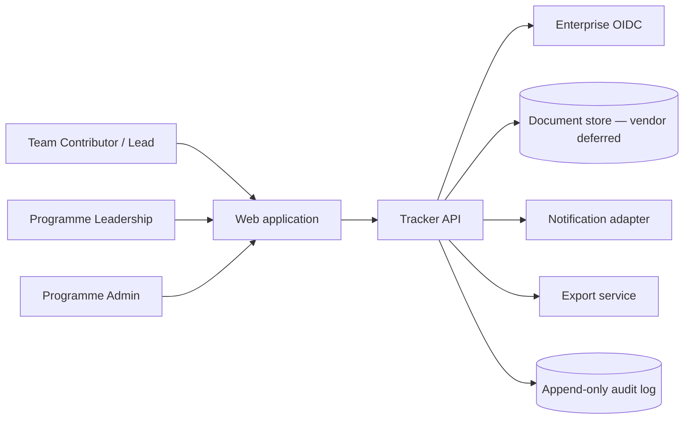
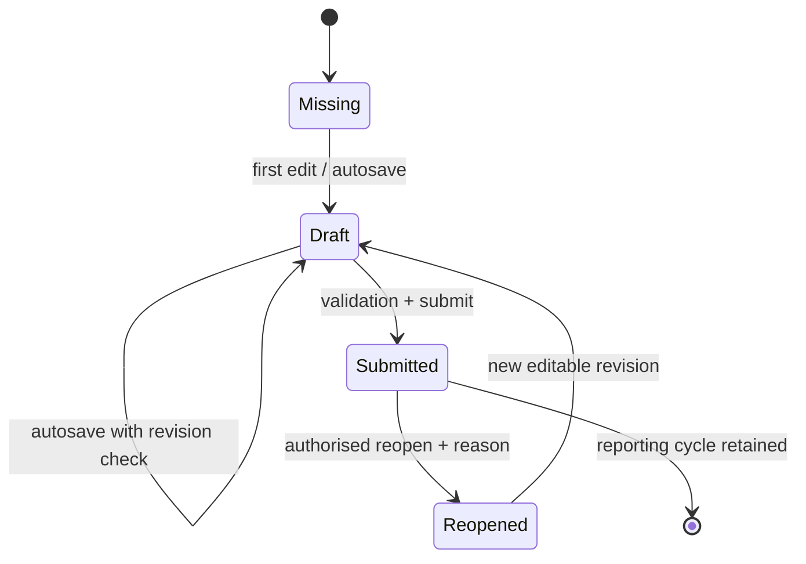

# VSDD Sprint Tracker — Technical and UX Design

## 1. Design intent

The product has one domain model and two task-focused interfaces:

- **Team Update** optimises structured weekly authoring, validation and submission.
- **Leadership View** optimises programme scanning, exception discovery and drill-down.

Leadership View is a projection of submitted Team Update data. It does not maintain a second copy of status content.

## 2. Reference implementation stack

Use this stack for the first implementation unless the target PTSB platform mandates an equivalent:

- Frontend: React + TypeScript + Vite
- Routing/data: React Router and TanStack Query
- Forms: React Hook Form with Zod schemas
- UI styling: CSS Modules or a project token layer; do not introduce a visually opinionated component library that changes the approved design
- API: REST/JSON with an OpenAPI 3.1 contract
- Backend reference: Node.js + TypeScript + Fastify/NestJS, or an equivalent supported enterprise service framework
- Database: **not selected in Phase A.** Phase A uses only the replaceable mock repository and adds no database dependency. Phase B persistence is designed to be database-agnostic with a preferred document-oriented (NoSQL) model. Vendor selection is deferred until enterprise platform constraints are known; likely candidates include Azure Cosmos DB or MongoDB. See §4a for the document aggregate and schema-version strategy.
- Authentication: enterprise OIDC; application receives stable subject ID and group/role claims
- Testing: Vitest, Testing Library, Playwright and API integration tests
- Observability: structured application telemetry without logging free-text status content

The current static prototype is a UX reference and a functional local adapter. Do not port its localStorage persistence into production.

## 3. System context



## 4. Domain model

### Core entities

```text
Programme
  id, name, active

Stream
  id, programmeId, name, sortOrder, active

Team
  id, streamId, name, sortOrder, active, archivedAt?

Sprint
  id, programmeId, label, startDate, endDate, status

ReportingCheckpoint
  id, sprintId, weekNumber(1|2), opensAt, dueAt, closesAt, status

TeamAssignment
  id, teamId, userSubject, role, validFrom, validTo?

UpdateDraft
  id, teamId, checkpointId, revision, status, updatedBy, updatedAt
  ragBusiness, ragDelivery, ragRelease
  businessGoal, technicalGoal, sprintCommitment, nextWeekCommitment
  planned, executed, passed, openCritical, blocked, automationPercent
  achievements
  aiUseCase, aiBenefit, aiValidation, aiNext
  leadershipAsk

ExceptionItem
  id, updateDraftId/updateVersionId, type(RISK|ISSUE|BLOCKER)
  impact, ownerSubject/displayName, dueDate, decisionSupport
  status(OPEN|RESOLVED), resolvedAt?, resolutionNote?

UpdateVersion
  id, teamId, checkpointId, versionNumber, submittedBy, submittedAt
  immutable snapshot of UpdateDraft + exception items

LeadershipDecision
  id, updateVersionId, decision, ownerSubject, dueDate?, status, createdAt

AuditEvent
  id, programmeId, entityType, entityId, action, actorSubject
  timestamp, previousVersion?, newVersion?, reason?, correlationId
```

### Key invariants

- At most one mutable draft exists for a team/checkpoint.
- A submitted `UpdateVersion` is immutable.
- Reopening copies the latest submitted version into a new draft and requires an audit reason.
- Leadership detail reads a specific `UpdateVersion`; draft preview is labelled and permission-scoped.
- Derived execution and pass rates are calculated, never stored as independently editable truth.
- Team archival never removes prior versions.

## 4a. Persistence model (document-oriented, vendor-neutral)

Phase A adds **no database dependency**; it uses only the replaceable mock repository. The following describes the Phase B design so that repository interfaces built now stay forward-compatible. No relational schema or migration tooling is mandated.

### Aggregate

Each team/checkpoint update is a single versioned JSON **document**. A document has a stable *query envelope* and a flexible *payload*.

```jsonc
{
  // --- stable query envelope (always present, indexable, never buried in payload) ---
  "id": "mmm-a|S14|C1",            // deterministic aggregate key
  "programmeId": "vsdd",
  "streamId": "MMM",
  "teamId": "mmm-a",
  "sprintId": "S14",
  "checkpointId": "C1",            // week 1 / week 2 checkpoint
  "state": "SUBMITTED",            // MISSING | DRAFT | SUBMITTED | REOPENED
  "revision": 12,                  // optimistic-concurrency token (ETag)
  "schemaVersion": 1,              // document contract version
  "rag": { "business": "GREEN", "delivery": "AMBER", "release": "AMBER" },
  "hasBlocker": true,              // denormalised leadership filter field
  "hasLeadershipAsk": true,        // denormalised leadership filter field
  "createdAt": "2026-08-25T08:00:00Z",
  "updatedAt": "2026-08-26T09:14:00Z",
  "submittedAt": "2026-08-26T09:14:00Z",

  // --- flexible payload (evolves over time; validated by version-specific schema) ---
  "payload": {
    "goals": { "business": "…", "technicalTesting": "…", "sprintCommitment": "…", "nextWeekCommitment": "…" },
    "qualityEvidence": { "planned": 120, "executed": 84, "passed": 79, "openCritical": 1, "blocked": 5, "automationPercent": 18 },
    "achievements": "…",
    "aiValue": { "useCase": "…", "measurableBenefit": "…", "humanValidation": "…", "nextExperimentConstraint": "…" },
    "exceptions": [],
    "leadershipAsk": "…"
    // future sections may be added here without breaking older documents
  }
}
```

### Collections / containers

- `updates` — current mutable draft aggregate per team/checkpoint (one document, keyed by the envelope above).
- `updateVersions` — immutable submitted snapshots (append-only); each carries its own `schemaVersion`.
- `auditEvents` — append-only audit documents.
- `decisions` — leadership decisions referencing a specific `updateVersionId`.
- Reference/config documents for hierarchy, sprints, checkpoints and assignments.

Partition/shard key preference: `programmeId` (with `teamId` as a natural sub-key) to keep a programme's working set co-located and leadership queries efficient.

### Schema-version strategy

- Every document (draft, submitted version, audit event) carries `schemaVersion`.
- Old submitted documents remain readable in their original format; they are **never** bulk-rewritten.
- Reads go through version-specific validators / read adapters that upcast an older `schemaVersion` into the current in-memory domain type at read time.
- New optional sections are added to the payload without breaking older documents.
- Stable leadership filter fields (`state`, `rag`, `hasBlocker`, `hasLeadershipAsk`, hierarchy IDs) live in the envelope so filtering and indexing never depend on reaching into an arbitrary payload shape.

### Guarantees

- Submitted versions are immutable JSON snapshots.
- Audit events are append-only documents.
- Optimistic concurrency uses `revision` as an ETag; a stale `revision` on write returns `409` and overwrites nothing.
- Submission-snapshot creation and audit-event creation must be atomic within the guarantees of the selected document store (e.g. a transactional batch/transaction within a single partition).
- Flexible storage does not mean unvalidated data: application validation stays explicit through TypeScript/Zod and the API schema regardless of the store.

## 4b. Local PoC architecture decision (proof of concept only)

The following decision fixes the concrete stack used to build and run the persistence proof of concept **locally**. It is a PoC implementation choice, not a production or PTSB platform commitment. The enterprise constraints in §2 (and task 0.2) remain open.

- **Backend:** Node.js 24 LTS with TypeScript and Fastify.
- **Document database:** a local MongoDB instance started through Docker Compose.
- **MongoDB is a PoC choice only.** It is not a production or PTSB platform commitment and does not pre-empt the approved-database decision.
- **Vendor-neutral boundary:** all persistence stays behind a vendor-neutral document repository adapter (the same repository contract used by the Phase A mock). MongoDB-specific code lives only inside that adapter; the domain and API layers never depend on it.
- **Schema versioning:** stored documents retain `schemaVersion` and are read through the read-time upcasting defined in §4a. No bulk rewrites.
- **Draft writes:** use optimistic concurrency via the `revision`/ETag guard defined in §4a; a stale revision returns `409` and overwrites nothing.
- **Immutability:** submitted versions and audit events remain immutable / append-only.
- **Authentication:** remains mocked for the local PoC. Production enterprise OIDC integration is Phase 8.

### Still-unresolved enterprise constraints

Production hosting, the OIDC provider and the approved database vendor remain **unresolved enterprise constraints** (see §2 and task 0.2). The local PoC choices above must not be read as resolving them.

## 5. Update state machine



UI labels:

- Missing — no draft or submission exists.
- Draft — team work is not leadership evidence.
- Submitted — immutable leadership evidence.
- Reopened — previously submitted content is being revised; latest submitted version remains visible with warning.
- Stale — submitted version belongs to an earlier checkpoint or exceeded an agreed freshness rule.

## 6. API design

### Read endpoints

```http
GET /api/v1/me
GET /api/v1/programmes/{programmeId}/hierarchy
GET /api/v1/programmes/{programmeId}/sprints?status=current
GET /api/v1/programmes/{programmeId}/reporting-summary?sprintId=&checkpointId=&streamId=&rag=&state=
GET /api/v1/teams/{teamId}/updates/{checkpointId}
GET /api/v1/teams/{teamId}/updates/{checkpointId}/versions
GET /api/v1/updates/{versionId}
GET /api/v1/updates/{versionId}/audit
```

### Write endpoints

```http
PUT  /api/v1/teams/{teamId}/drafts/{checkpointId}
POST /api/v1/teams/{teamId}/drafts/{checkpointId}/submit
POST /api/v1/updates/{versionId}/reopen
POST /api/v1/updates/{versionId}/decisions
POST /api/v1/programmes/{programmeId}/exports
```

### Draft update contract

Every `PUT` carries:

```json
{
  "revision": 12,
  "rag": {
    "business": "GREEN",
    "delivery": "AMBER",
    "release": "AMBER"
  },
  "goals": {
    "business": "...",
    "technicalTesting": "...",
    "sprintCommitment": "...",
    "nextWeekCommitment": "..."
  },
  "qualityEvidence": {
    "planned": 120,
    "executed": 84,
    "passed": 79,
    "openCritical": 1,
    "blocked": 5,
    "automationPercent": 18
  },
  "achievements": "...",
  "aiValue": {
    "useCase": "...",
    "measurableBenefit": "...",
    "humanValidation": "...",
    "nextExperimentConstraint": "..."
  },
  "exceptions": [],
  "leadershipAsk": "..."
}
```

The API returns the new `revision`, `updatedAt` and `updatedBy`. If the supplied revision is stale, return `409 Conflict` with server metadata and do not overwrite either version.

### Error envelope

```json
{
  "error": {
    "code": "DRAFT_REVISION_CONFLICT",
    "message": "This draft changed after you opened it.",
    "correlationId": "...",
    "fieldErrors": []
  }
}
```

User-facing copy must explain what happened and the next action. Do not show raw stack traces or generic “Something went wrong” errors.

## 7. Frontend structure

```text
src/
  app/
    routes.tsx
    queryClient.ts
    auth/
  domain/
    update.ts
    hierarchy.ts
    schemas.ts
  api/
    client.ts
    updateApi.ts
    leadershipApi.ts
  features/
    team-update/
      TeamUpdatePage.tsx
      UpdateContextRail.tsx
      RagSelector.tsx
      GoalsCommitmentsSection.tsx
      QualityEvidenceSection.tsx
      AchievementsSection.tsx
      AiValueSection.tsx
      ExceptionEditor.tsx
      LeadershipAskField.tsx
      SubmissionBar.tsx
    leadership/
      LeadershipPage.tsx
      LeadershipFilters.tsx
      ProgrammeSummary.tsx
      HierarchyTree.tsx
      TeamStatusRow.tsx
      SprintWeekNodes.tsx
      TeamUpdateDetail.tsx
  components/
    Button.tsx
    Field.tsx
    StatusDot.tsx
    StatusChip.tsx
    EmptyState.tsx
    ErrorState.tsx
    Skeleton.tsx
    Toast.tsx
  styles/
    tokens.css
    global.css
```

Component rules:

- `RagSelector` is a semantic radio group and always renders text with colour.
- `HierarchyTree` owns expansion state, keyboard traversal and selected path; it does not own fetched update data.
- `TeamUpdateDetail` renders an immutable DTO and never sends writes.
- `ExceptionEditor` uses stable IDs; do not identify rows by array index after persistence.
- Forms use visible labels. Placeholders are examples only.

## 8. Team Update interaction design

### Page structure

1. Sticky application navigation.
2. Page title and save/submission state.
3. Context rail: stream, team, sprint and week.
4. Three RAG selectors.
5. Goals & commitments with four explicit fields.
6. Quality evidence, achievements and AI value.
7. Editable exception table.
8. Leadership ask.
9. Sticky Save draft / Submit update action bar.

### Autosave

- Debounce after meaningful field changes.
- Display `Saving draft…`, `Draft saved at HH:MM`, or an actionable failure state.
- Keep unsaved text in memory if the API fails.
- On navigation with a pending/failed save, warn before discarding content.
- Never change a submitted version silently; editing it begins the authorised reopen flow.

### Validation

- Validate individual fields on blur.
- Validate the full update on submit.
- Focus the first invalid field and show an error summary linked to invalid controls.
- Warnings about metric inconsistencies are overridable only with an explanation.
- Amber/Red without an exception or rationale is a blocking submission error.

## 9. Leadership View interaction design

### Hierarchy

- Left master pane shows Programme → Stream → Team.
- Selecting a team reveals Sprint → Week below that team and loads detail in the right pane.
- Each team row shows B/T/R status and update state.
- Tree nodes support mouse, touch and keyboard interaction; expansion must not depend on hover.

### Detail

Order is fixed:

1. Breadcrumb and version state.
2. Three RAG blocks.
3. Goals & commitments.
4. Quality evidence.
5. Week trajectory and AI value.
6. Risks / issues / blockers.
7. Leadership ask and recorded leadership decision.

### Filters

- Stream, any RAG status and update state.
- Filters update the tree and programme counts together.
- Preserve selected item if it remains visible; otherwise select the first visible item and announce the context change.
- Provide a reset action in the zero-result state.

## 10. Visual system

Use the approved prototype as the source of truth.

### Palette

- PTSB orange `#FC4C02`: active navigation and primary actions only.
- Graphite `#2E2C2B`: primary text.
- Neutral white `#FFFFFF`, subtle surface `#FAF9F7`, divider `#DEDAD6`.
- Aqua `#C7EEF0` / dark aqua `#23747B`: hierarchy metadata and secondary emphasis.
- Green `#2F8F5B`, Amber `#E7A400`, Red `#C84038`: status semantics only.

Production CSS may use approved OKLCH equivalents, but exported documents and design tokens must retain the brand hex references.

### Typography and density

- Aptos or approved metric-compatible humanist sans.
- Fixed product type scale: 12 / 14 / 16 / 20 / 24 / 32 px equivalent in rem.
- 4-point spacing foundation: 4 / 8 / 12 / 16 / 24 / 32 / 48.
- Flat tonal layers and 1 px dividers. Avoid decorative shadows.
- Card/container radius: 4–12 px; no excessive rounding.

### Prohibited visual patterns

- No gradients, glassmorphism or decorative grid backgrounds.
- No giant “hero metric” treatment.
- No wall of identical cards or nested cards.
- No coloured side stripes on alert cards.
- No RAG colour without a text label.
- No PowerPoint slide embedded as a page layout.

## 11. Responsive design

- Desktop ≥1024 px: persistent context/tree master pane and detail pane.
- Tablet 768–1023 px: master pane above or beside detail based on available width; 44 px targets.
- Phone <768 px: single-column authoring; leadership hierarchy becomes a collapsible master section above detail; tables reflow into labelled records.
- Core fields and exceptions remain editable on phone.
- Sticky action bar becomes in-flow when it would obscure content or the virtual keyboard.

## 12. Accessibility

- WCAG 2.2 AA target.
- Use landmarks, headings, fieldsets, legends, labels and table semantics.
- Tabs implement roving tabindex and arrow-key navigation.
- Tree interaction follows the WAI-ARIA tree pattern or a simpler disclosure/list pattern with equivalent keyboard clarity.
- Focus remains visible and moves intentionally after validation, submission and selection changes.
- Announce save, submit, filter and conflict outcomes through a polite live region.
- Do not disable browser zoom.
- Respect `prefers-reduced-motion`.

## 13. Security design

- Validate and authorise every request server-side against programme/team assignments.
- Encode user-authored text on output; do not render stored HTML.
- Use same-site secure cookies or an approved token pattern; never persist access tokens in localStorage.
- Apply CSP with an allowlist appropriate to the deployment platform.
- Use parameterised / server-side-constructed queries; never build datastore queries from raw user input regardless of the selected document store.
- Protect export endpoints against programme-data enumeration.
- Separate audit-event access from general application logs.

## 14. Test strategy

### Unit

- Domain validation and derived rates.
- RAG/exception rules.
- State transitions and permission policy.
- Filter predicates and summary calculations.

### Component

- RAG selector keyboard interaction.
- Required goal fields and error linking.
- Exception add/edit/resolve flow.
- Autosave states and retry.
- Hierarchy selection and filter zero state.

### API integration

- Team-scoped authorisation.
- Atomic submit plus audit creation.
- `409` conflict handling.
- Reopen reason and immutable prior version.
- Export scoping.

### End to end

1. Contributor edits and auto-saves a draft.
2. Team Lead submits it.
3. Leadership sees the same values under the correct hierarchy path.
4. Leadership records a decision against the ask.
5. Authorised lead reopens, changes and resubmits; audit comparison retains both versions.
6. Two editors produce a conflict without silent data loss.

### Accessibility and visual regression

- Automated axe scan on both primary screens and error/empty states.
- Keyboard-only scenario for complete draft → submit → leadership drill-down.
- Visual regression at 1440×1000, 1024×768, 768×1024 and 390×844.
- Verify RAG meaning in grayscale and with common colour-vision simulations.

## 15. Migration path from prototype

1. Extract prototype colours, spacing and components into `tokens.css`.
2. Port seed hierarchy into a typed fixture and mock API adapter.
3. Build React screens against repository interfaces, not direct browser storage.
4. Implement the server API and document-store containers/collections (see §4a); no relational migration step is implied.
5. Swap the mock adapter for the real API behind the same query hooks.
6. Add OIDC/RBAC, audit, notifications and export.
7. Run the acceptance and security suites before pilot rollout.
